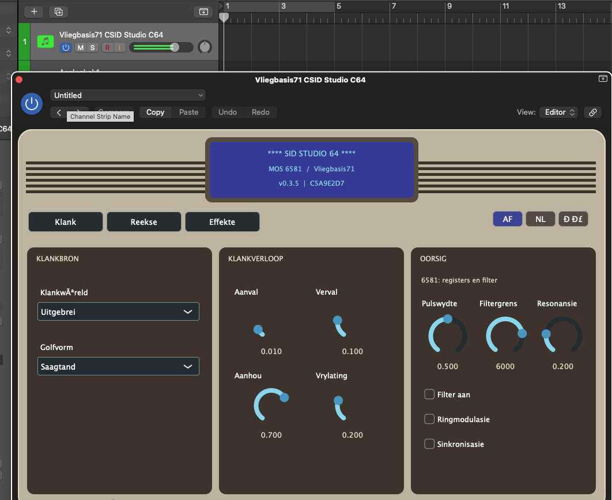

# 🎹 SID Studio 64

**’n Commodore 64-geïnspireerde sagteware-sintetiseerder vir macOS**  
**Ontwikkelaar en projek:** Vliegbasis71  
**Weergawe:** 0.3.5 (ontwikkelingsweergawe)  
**Tegnologie:** C++17 · JUCE 8 · CMake · Audio Unit v2

> **Van die klankwêreld van die Commodore 64 na ’n moderne musiekateljee.**

## 1. Wat is SID Studio 64?

SID Studio 64 is ’n inheemse macOS-sintetiseerder wat deur die kenmerkende klank van die **MOS 6581 SID**-skyfie in die Commodore 64 geïnspireer is. Die projek kombineer retro-klankkarakter met moderne MIDI-beheer, ’n ingeboude stapsekwenseerder en ’n arpeggiator.

Die toepassing is bedoel vir musikante, komponiste en klankontwerpers wat klassieke 8-bis-klanke in ’n hedendaagse werksvloei wil gebruik. Dit kan as ’n **Audio Unit (AUv2)** in ’n geskikte musiekprogram, soos Logic Pro, of as ’n **selfstandige macOS-toepassing** gebou word.

**Belangrik:** SID Studio 64 is ’n *SID-geïnspireerde* sintetiseerder, nie ’n siklus-presiese nabootsing van die oorspronklike MOS 6581 nie.





## 2. Funksies in weergawe 0.3.5

| Gebied | Beskrywing |
|---|---|
| **Klankopwekking** | Driehoek-, saagtand-, puls- en ruisgolfvorms. |
| **Klankkarakter** | Instellings vir pulsbreedte, ringmodulasie en ossillatorsinchronisasie. |
| **Klankvorming** | Aanval, verval, aanhou en vrylating (ADSR), plus filtergrens en resonansie. |
| **Speelmodusse** | **Regstreeks**, **Stappe** en **Arpeggio**. |
| **Stapsekwenseerder** | 16 of 32 stappe; ritmiese verdeling van kwartnote tot twee-en-dertigste note; individuele stappe kan aan- of afgeskakel word. |
| **Arpeggiator** | Vyf rigtings: **Op**, **Af**, **Op en af**, **Willekeurig** en **Speelvolgorde**. |
| **Hou vas** | Opsionele vasvang van arpeggionote; **standaard AF**. Die gedrag ná MIDI-nootvrystelling moet nog in Logic Pro finaal bevestig word. |
| **Tydsberekening** | Ondersteuning vir tempo en musikale posisie vanaf die gasheer wanneer die vervoer loop; interne klok as terugval wanneer dit stilstaan. |
| **Voorkoms** | ’n Koppelvlak geïnspireer deur die Commodore 64 se bekende rekenaarkas en kleure. |
| **Formate** | macOS **Audio Unit v2** en **selfstandige toepassing**. |

Die huidige Audio Unit publiseer **51 parameters** vir beheer en outomatisering. Die AU-identifikasie is **`aumu / Si64 / Vl71`**.

### Wat is nog op die ontwikkelingspad?

Die volgende is **beplande funksies**, nie voltooide eienskappe van weergawe 0.3.5 nie:

- ’n Versameling van **330 onderskeibare fabrieksklanke** in 11 kategorieë, met ’n klankblaaier en die vermoë om eie klanke te stoor.
- ’n Biblioteek van ongeveer **90 oorspronklike C64-geïnspireerde musikale patrone**, asook die moontlikheid om MIDI-patrone in te voer.
- Individuele toonhoogtes per sekwenseerderstap, patrone, aksente, swaai en meer gevorderde ritmiese beheer.
- Verdere verfyning van die SID-klank, effekte en gebruikerskoppelvlak.
- ’n Volledige **Afrikaanse, Nederlandse en Russiese** gebruikerskoppelvlak sonder Engelse teks in die instrument.

## 3. Vereistes

- ’n **Mac** met macOS en Apple se **Xcode Command Line Tools** (of Xcode).
- **CMake 3.22** of nuwer.
- **Git** en internettoegang vir die eerste bou, sodat CMake **JUCE 8.0.10** kan aflaai.
- ’n Geskikte AU-gasheer, byvoorbeeld **Logic Pro**, om die inprop te gebruik.

Hierdie projek is op ’n **Mac mini M4** met AppleClang gebou en die Audio Unit is met Apple se `auval` getoets. Die projek se bronkode gebruik C++17.

## 4. Bou die projek

Open **Terminal** en gaan na die projekgids:

```bash
cd /Volumes/data1/AI_Gerelateerd/github/muziek_gerelateerd/C64-SID-Studio
```

### Gewone bou

```bash
chmod +x ./build.sh
./build.sh
```

Die skrip stel CMake op, bou die toepassing en AU, voer die C++-toetse uit en laat `auval` loop indien dit beskikbaar is.

### Volledige skoon herbou

Gebruik hierdie opdrag wanneer jy die projek verskuif het, die CMake-kas verouderd is of jy van voor af wil bou:

```bash
./build.sh --rebuild
```

**Let wel:** `--rebuild` verwyder die **gegenereerde inhoud van die gekose bougids**. Moenie persoonlike lêers daarin bêre nie. Die bronkode word nie verwyder nie.

### Ander bou-opsies

```bash
./build.sh --skip-auval             # Bou en toets sonder AU-validering
./build.sh --build-dir build-toets # Gebruik 'n ander bougids binne die projek
./build.sh --help                  # Wys beskikbare opsies
```

Die bou-skrip herken ook ’n CMake-kas wat na ’n ou projekligging verwys en begin dan outomaties met ’n skoon herbou.

### Handmatige CMake-bou

```bash
cmake -S . -B build -DCMAKE_BUILD_TYPE=Release
cmake --build build --config Release --parallel 4
ctest --test-dir build --output-on-failure -C Release
auval -v aumu Si64 Vl71
```

As jy die projek verskuif het en die handmatige CMake-opdragte ’n padfout gee, gebruik eerder `./build.sh --rebuild`.

## 5. Waar is die geboude toepassing?

Na ’n suksesvolle macOS-bou is die artefakte normaalweg hier:

**Selfstandige toepassing**

```text
build/SIDStudio64_artefacts/Release/Standalone/SID Studio 64.app
```

**Audio Unit**

```text
build/SIDStudio64_artefacts/Release/AU/SID Studio 64.component
```

Die CMake-konfigurasie gebruik `COPY_PLUGIN_AFTER_BUILD TRUE`, wat die Audio Unit na die gebruiker se inpropgids kopieer:

```text
~/Library/Audio/Plug-Ins/Components/SID Studio 64.component
```

Herbegin Logic Pro indien dit reeds oop was toe die Audio Unit vervang is.

## 6. Gebruik in Logic Pro

1. Maak ’n nuwe **sagteware-instrumentspoor** oop en kies **SID Studio 64** as die instrument.
2. Kies **Regstreeks** om die sintetiseerder direk met ’n MIDI-klawerbord te bespeel.
3. Kies **Stappe** om ’n ritmiese patroon met 16 of 32 stappe te hoor.
4. Kies **Arpeggio** en hou een of meer MIDI-note in om die arpeggiator te gebruik.
5. Kies die arpeggiorigting en gebruik **Hou vas** slegs wanneer jy doelbewus note wil laat aanhou ná jy die klawers losgelaat het.

**Toetsstatus:** Die bou, vier C++-toetse en Apple se AU-validering het geslaag. Die hoorbare gedrag van **Hou vas** in weergawe 0.3.5 wag nog op finale gebruikersbevestiging. ’n Suksesvolle `auval` beteken nie op sigself dat elke musikale funksie korrek klink nie.

## 7. Toetse en probleemoplossing

Die projek bevat vier outomatiese toetsgroepe:

| Toets | Doel |
|---|---|
| `sid64_arpeggiator` | Arpeggiator-logika |
| `sid64_sequence` | Sekwenseerder en musikale tydsberekening |
| `sid64_engine` | Sintese-enjin |
| `sid64_character` | SID-geïnspireerde klankkarakter |

Om die toetse apart te laat loop:

```bash
ctest --test-dir build --output-on-failure -C Release
```

Om die Audio Unit apart te valideer:

```bash
auval -v aumu Si64 Vl71
```

**CMake kla oor ’n ou gids:** gebruik `./build.sh --rebuild`.

**Die AU verskyn nie in Logic Pro nie:** bevestig eers dat die AU-bou en `auval` slaag, en herbegin daarna Logic Pro.

**Die sekwenseerder of arpeggiator is stil:** maak seker dat die regte speelmodus gekies is, dat die betrokke stappe aangeskakel is, en dat die arpeggiator MIDI-note ontvang.

## 8. Projekstruktuur

```text
C64-SID-Studio/
├── CMakeLists.txt          # Boukonfigurasie
├── build.sh                # Bou-, herbou- en toetsskrip
├── README.md               # Hierdie dokument
├── AGILE_BACKLOG.md        # Ontwikkelingswerk en prioriteite
├── src/                    # Sintese, MIDI, sekwenseerder en koppelvlak
└── tests/                  # Outomatiese C++-toetse
```

Die `build/`-gids word deur CMake gegenereer en hoef nie in weergawebeheer opgeneem te word nie.

## 9. Krediete

**SID Studio 64** is ’n projek van **Vliegbasis71**.

- **Projekkonsep, musikale rigting en praktiese toetsing:** Vliegbasis71.
- **Sagteware-ontwikkeling:** Vliegbasis71, met KI-ondersteunde ontwikkeling en toetsing.
- **JUCE:** Die oopbron-C++-raamwerk wat vir die toepassing en Audio Unit gebruik word.
- **CMake:** Die boustelsel.
- **Inspirasie:** Die Commodore 64 en die historiese MOS SID-klankskyfie.

Die name **Commodore 64**, **MOS** en **SID** word hier gebruik om die historiese inspirasie te beskryf. Hierdie projek maak geen aanspraak op amptelike verbintenis met die oorspronklike handelsmerke of vervaardigers nie.

---

**© 2026 Vliegbasis71 — SID Studio 64**  
*Gebou met nuuskierigheid, musiek en ’n liefde vir die 8-bis-era.*

**Lisensie:** ’n Openbare sagtewarelisensie is nog nie in die projeklêers gespesifiseer nie; moenie aanvaar dat die bronkode reeds onder ’n oopbronlisensie versprei word nie.
